# [📈 Live Status](https://trstat.sylvy.me): <!--live status--> **🟧 Partial outage**

This repository contains the open-source uptime monitor and status page for [Upptime](https://upptime.js.org), powered by [Upptime](https://github.com/upptime/upptime).

With [Upptime](https://upptime.js.org), you can get your own unlimited and free uptime monitor and status page, powered entirely by a GitHub repository. We use [Issues](https://github.com/upptime/upptime/issues) as incident reports, [Actions](https://github.com/Fluff663/trackerstatus/actions) as uptime monitors, and [Pages](https://trstat.sylvy.me) for the status page.

<!--start: status pages-->
<!-- This summary is generated by Upptime (https://github.com/upptime/upptime) -->
<!-- Do not edit this manually, your changes will be overwritten -->
<!-- prettier-ignore -->
| URL | Status | History | Response Time | Uptime |
| --- | ------ | ------- | ------------- | ------ |
|  Abnormal | 🟥 Down | [abnormal.yml](https://github.com/Fluff663/trackerstatus/commits/HEAD/history/abnormal.yml) | 

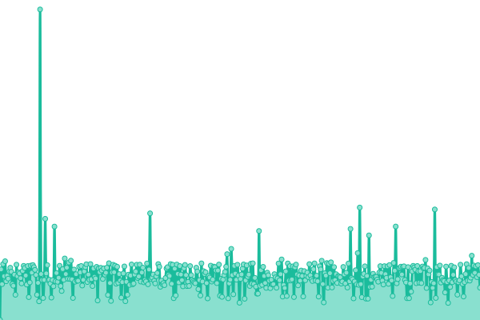 808ms
     
 | 

<a href="https://trstat.sylvy.me/history/abnormal">61.15%</a>
    

|  Aither | 🟩 Up | [aither.yml](https://github.com/Fluff663/trackerstatus/commits/HEAD/history/aither.yml) | 

 560ms
     
 | 

<a href="https://trstat.sylvy.me/history/aither">100.00%</a>
    

|  AlphaRatio | 🟩 Up | [alpha-ratio.yml](https://github.com/Fluff663/trackerstatus/commits/HEAD/history/alpha-ratio.yml) | 

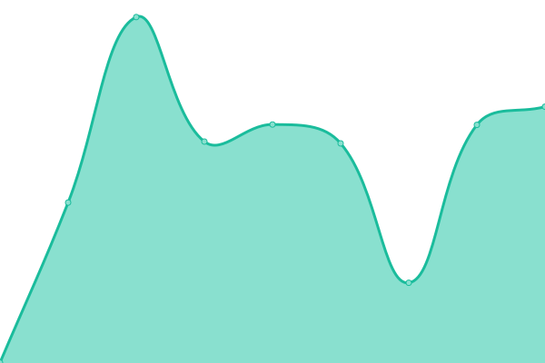 600ms
     
 | 

<a href="https://trstat.sylvy.me/history/alpha-ratio">99.76%</a>
    

|  AnimeBytes | 🟩 Up | [anime-bytes.yml](https://github.com/Fluff663/trackerstatus/commits/HEAD/history/anime-bytes.yml) | 

 239ms
     
 | 

<a href="https://trstat.sylvy.me/history/anime-bytes">100.00%</a>
    

|  AnimeTosho | 🟩 Up | [anime-tosho.yml](https://github.com/Fluff663/trackerstatus/commits/HEAD/history/anime-tosho.yml) | 

 765ms
     
 | 

<a href="https://trstat.sylvy.me/history/anime-tosho">100.00%</a>
    

|  Anthelion | 🟩 Up | [anthelion.yml](https://github.com/Fluff663/trackerstatus/commits/HEAD/history/anthelion.yml) | 

 910ms
     
 | 

<a href="https://trstat.sylvy.me/history/anthelion">98.71%</a>
    

|  AsianCinema | 🟩 Up | [asian-cinema.yml](https://github.com/Fluff663/trackerstatus/commits/HEAD/history/asian-cinema.yml) | 

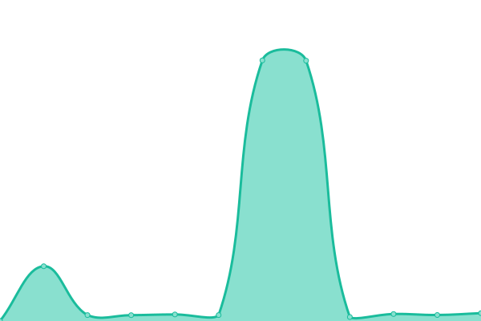 539ms
     
 | 

<a href="https://trstat.sylvy.me/history/asian-cinema">99.84%</a>
    

|  BakaBT | 🟩 Up | [baka-bt.yml](https://github.com/Fluff663/trackerstatus/commits/HEAD/history/baka-bt.yml) | 

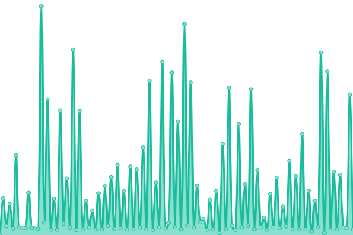 4069ms
     
 | 

<a href="https://trstat.sylvy.me/history/baka-bt">88.69%</a>
    

|  BitSexy | 🟥 Down | [bit-sexy.yml](https://github.com/Fluff663/trackerstatus/commits/HEAD/history/bit-sexy.yml) | 

 0ms
     
 | 

<a href="https://trstat.sylvy.me/history/bit-sexy">0.00%</a>
    

|  Blutopia | 🟩 Up | [blutopia.yml](https://github.com/Fluff663/trackerstatus/commits/HEAD/history/blutopia.yml) | 

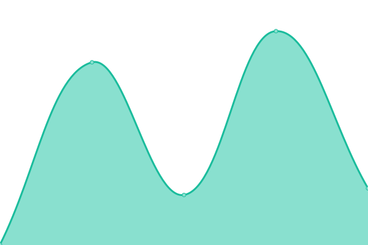 544ms
     
 | 

<a href="https://trstat.sylvy.me/history/blutopia">100.00%</a>
    

|  CGPeers | 🟩 Up | [cg-peers.yml](https://github.com/Fluff663/trackerstatus/commits/HEAD/history/cg-peers.yml) | 

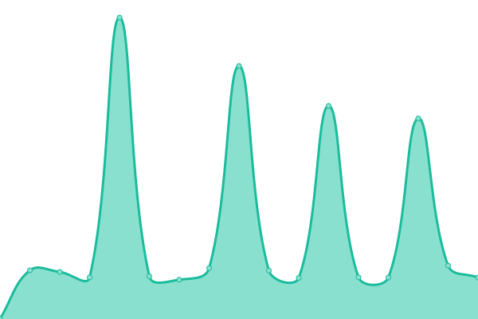 1070ms
     
 | 

<a href="https://trstat.sylvy.me/history/cg-peers">99.11%</a>
    

|  CathodeRay-Tube | 🟩 Up | [cathode-ray-tube.yml](https://github.com/Fluff663/trackerstatus/commits/HEAD/history/cathode-ray-tube.yml) | 

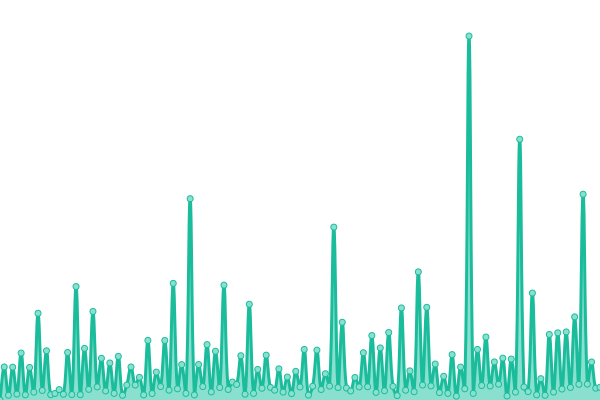 3944ms
     
 | 

<a href="https://trstat.sylvy.me/history/cathode-ray-tube">95.75%</a>
    

|  DigitalCore | 🟩 Up | [digital-core.yml](https://github.com/Fluff663/trackerstatus/commits/HEAD/history/digital-core.yml) | 

 439ms
     
 | 

<a href="https://trstat.sylvy.me/history/digital-core">100.00%</a>
    

|  DocsPedia | 🟩 Up | [docs-pedia.yml](https://github.com/Fluff663/trackerstatus/commits/HEAD/history/docs-pedia.yml) | 

 455ms
     
 | 

<a href="https://trstat.sylvy.me/history/docs-pedia">100.00%</a>
    

|  FearNoPeer | 🟩 Up | [fear-no-peer.yml](https://github.com/Fluff663/trackerstatus/commits/HEAD/history/fear-no-peer.yml) | 

 454ms
     
 | 

<a href="https://trstat.sylvy.me/history/fear-no-peer">100.00%</a>
    

|  FileList | 🟩 Up | [file-list.yml](https://github.com/Fluff663/trackerstatus/commits/HEAD/history/file-list.yml) | 

 612ms
     
 | 

<a href="https://trstat.sylvy.me/history/file-list">100.00%</a>
    

|  GazelleGames | 🟥 Down | [gazelle-games.yml](https://github.com/Fluff663/trackerstatus/commits/HEAD/history/gazelle-games.yml) | 

 465ms
     
 | 

<a href="https://trstat.sylvy.me/history/gazelle-games">97.69%</a>
    

|  The Geeks | 🟩 Up | [the-geeks.yml](https://github.com/Fluff663/trackerstatus/commits/HEAD/history/the-geeks.yml) | 

 763ms
     
 | 

<a href="https://trstat.sylvy.me/history/the-geeks">97.59%</a>
    

|  HDArea | 🟩 Up | [hd-area.yml](https://github.com/Fluff663/trackerstatus/commits/HEAD/history/hd-area.yml) | 

 508ms
     
 | 

<a href="https://trstat.sylvy.me/history/hd-area">100.00%</a>
    

|  IPTorrents | 🟥 Down | [ip-torrents.yml](https://github.com/Fluff663/trackerstatus/commits/HEAD/history/ip-torrents.yml) | 

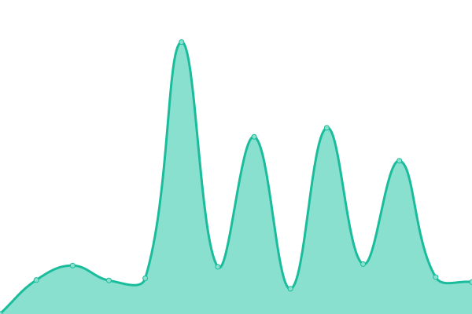 1091ms
     
 | 

<a href="https://trstat.sylvy.me/history/ip-torrents">0.00%</a>
    

|  LST | 🟩 Up | [lst.yml](https://github.com/Fluff663/trackerstatus/commits/HEAD/history/lst.yml) | 

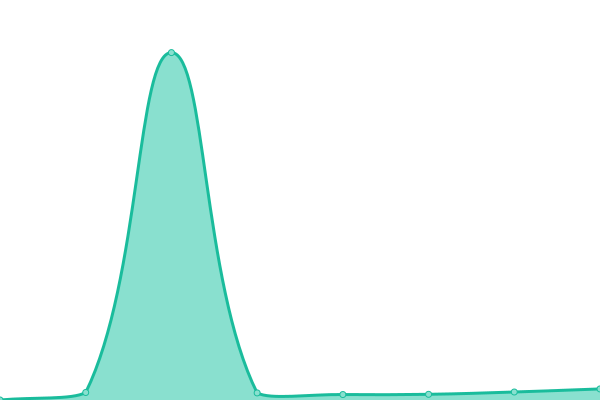 541ms
     
 | 

<a href="https://trstat.sylvy.me/history/lst">100.00%</a>
    

|  Milkie | 🟩 Up | [milkie.yml](https://github.com/Fluff663/trackerstatus/commits/HEAD/history/milkie.yml) | 

 409ms
     
 | 

<a href="https://trstat.sylvy.me/history/milkie">100.00%</a>
    

|  MyAnonaMouse | 🟩 Up | [my-anona-mouse.yml](https://github.com/Fluff663/trackerstatus/commits/HEAD/history/my-anona-mouse.yml) | 

 581ms
     
 | 

<a href="https://trstat.sylvy.me/history/my-anona-mouse">100.00%</a>
    

|  Nebulance | 🟩 Up | [nebulance.yml](https://github.com/Fluff663/trackerstatus/commits/HEAD/history/nebulance.yml) | 

 1050ms
     
 | 

<a href="https://trstat.sylvy.me/history/nebulance">98.71%</a>
    

|  Old Toons World | 🟩 Up | [old-toons-world.yml](https://github.com/Fluff663/trackerstatus/commits/HEAD/history/old-toons-world.yml) | 

 449ms
     
 | 

<a href="https://trstat.sylvy.me/history/old-toons-world">100.00%</a>
    

|  Orpheus | 🟩 Up | [orpheus.yml](https://github.com/Fluff663/trackerstatus/commits/HEAD/history/orpheus.yml) | 

 916ms
     
 | 

<a href="https://trstat.sylvy.me/history/orpheus">100.00%</a>
    

|  Redacted | 🟩 Up | [redacted.yml](https://github.com/Fluff663/trackerstatus/commits/HEAD/history/redacted.yml) | 

 910ms
     
 | 

<a href="https://trstat.sylvy.me/history/redacted">99.60%</a>
    

|  ReelFLiX | 🟩 Up | [reel-f-li-x.yml](https://github.com/Fluff663/trackerstatus/commits/HEAD/history/reel-f-li-x.yml) | 

 447ms
     
 | 

<a href="https://trstat.sylvy.me/history/reel-f-li-x">100.00%</a>
    

|  RetroFlix | 🟩 Up | [retro-flix.yml](https://github.com/Fluff663/trackerstatus/commits/HEAD/history/retro-flix.yml) | 

 369ms
     
 | 

<a href="https://trstat.sylvy.me/history/retro-flix">100.00%</a>
    

|  Shazbat | 🟩 Up | [shazbat.yml](https://github.com/Fluff663/trackerstatus/commits/HEAD/history/shazbat.yml) | 

 162ms
     
 | 

<a href="https://trstat.sylvy.me/history/shazbat">100.00%</a>
    

|  SpeedApp | 🟩 Up | [speed-app.yml](https://github.com/Fluff663/trackerstatus/commits/HEAD/history/speed-app.yml) | 

 459ms
     
 | 

<a href="https://trstat.sylvy.me/history/speed-app">100.00%</a>
    

|  SpeedCD | 🟥 Down | [speed-cd.yml](https://github.com/Fluff663/trackerstatus/commits/HEAD/history/speed-cd.yml) | 

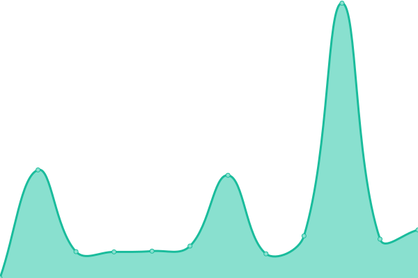 404ms
     
 | 

<a href="https://trstat.sylvy.me/history/speed-cd">0.25%</a>
    

|  TheScenePlace | 🟥 Down | [the-scene-place.yml](https://github.com/Fluff663/trackerstatus/commits/HEAD/history/the-scene-place.yml) | 

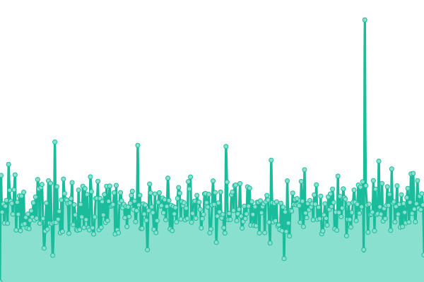 526ms
     
 | 

<a href="https://trstat.sylvy.me/history/the-scene-place">63.62%</a>
    

|  TorrentDay | 🟩 Up | [torrent-day.yml](https://github.com/Fluff663/trackerstatus/commits/HEAD/history/torrent-day.yml) | 

 488ms
     
 | 

<a href="https://trstat.sylvy.me/history/torrent-day">100.00%</a>
    

|  Torrentleech | 🟩 Up | [torrentleech.yml](https://github.com/Fluff663/trackerstatus/commits/HEAD/history/torrentleech.yml) | 

 1739ms
     
 | 

<a href="https://trstat.sylvy.me/history/torrentleech">99.34%</a>
    

|  TorrentSeeds | 🟩 Up | [torrent-seeds.yml](https://github.com/Fluff663/trackerstatus/commits/HEAD/history/torrent-seeds.yml) | 

 498ms
     
 | 

<a href="https://trstat.sylvy.me/history/torrent-seeds">100.00%</a>
    

|  UHDBits | 🟩 Up | [uhd-bits.yml](https://github.com/Fluff663/trackerstatus/commits/HEAD/history/uhd-bits.yml) | 

 402ms
     
 | 

<a href="https://trstat.sylvy.me/history/uhd-bits">100.00%</a>
    

|  XtremeBytes | 🟩 Up | [xtreme-bytes.yml](https://github.com/Fluff663/trackerstatus/commits/HEAD/history/xtreme-bytes.yml) | 

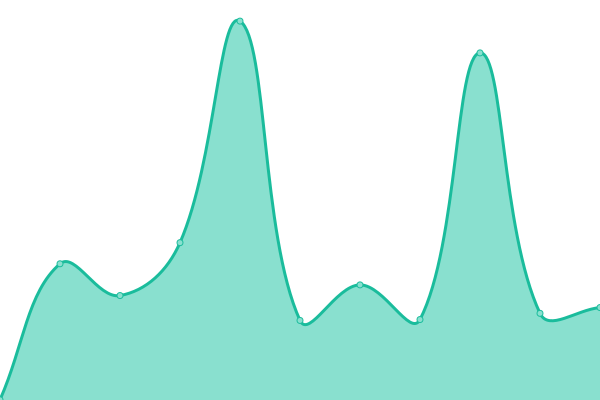 1231ms
     
 | 

<a href="https://trstat.sylvy.me/history/xtreme-bytes">99.37%</a>
    

<!--end: status pages-->

[**Visit our status website →**](https://trstat.sylvy.me)

## 📄 License

- Powered by: [Upptime](https://github.com/upptime/upptime)
- Code: [MIT](./LICENSE) © [Upptime](https://upptime.js.org)
- Data in the `./history` directory: [Open Database License](https://opendatacommons.org/licenses/odbl/1-0/)
